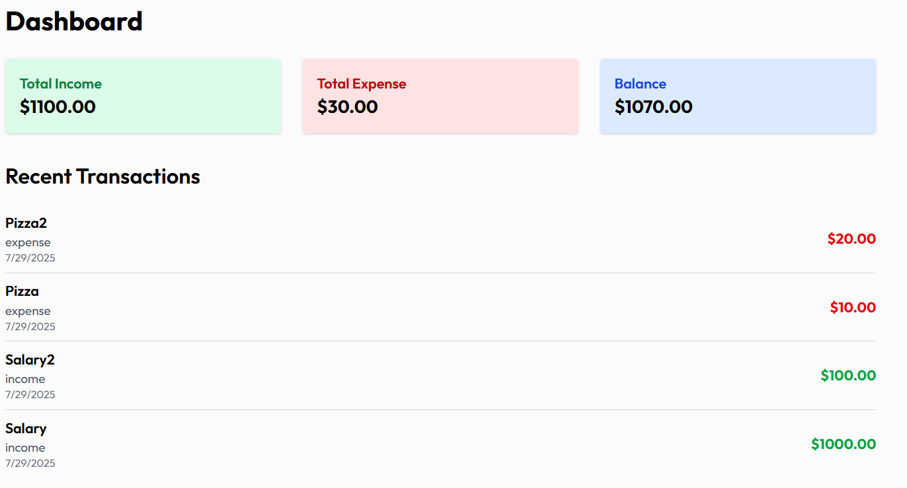
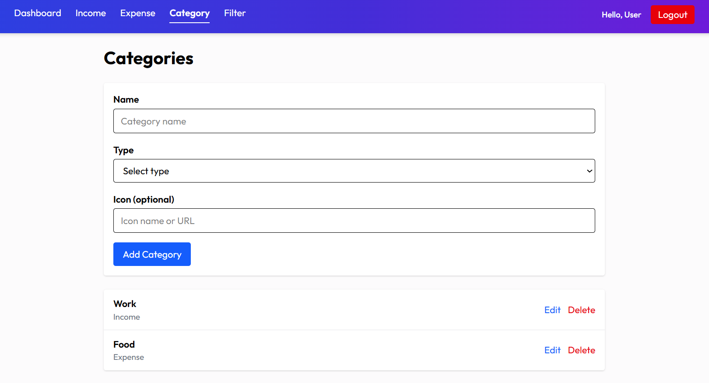
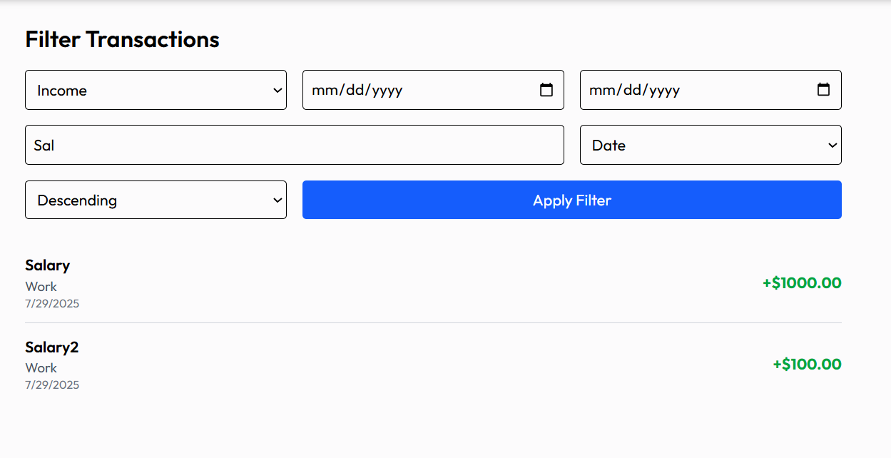

# Money Manager Full-Stack Application

## Overview

This is a **full-stack personal finance management application** built with **Spring Boot** (backend) and **React** (frontend), designed to help users track incomes, expenses, and manage financial categories efficiently. The app provides secure authentication, dynamic dashboards, CRUD operations, filtering, and email notifications — all following best practices in modern web development.

---
## Screenshots

### Dashboard View

### Category Management

### Filter

### Register

## Features

- **User Authentication & Authorization**
  - Secure user registration and login with **JWT-based authentication**
  - Email account activation via tokenized links
  - Password encryption with BCrypt

- **Dashboard**
  - Real-time display of total income, expenses, and balance
  - Recent transaction list with clear distinction between income and expenses

- **Category Management**
  - Create, update, delete financial categories with type separation (income/expense)
  - Category filtering for streamlined organization

- **Income and Expense Tracking**
  - Full CRUD support for income and expense records
  - Assign categories to transactions for detailed tracking
  - Validation to ensure data integrity

- **Advanced Filtering**
  - Filter transactions by date range, keyword, type, and sort order
  - User-specific data isolation for privacy and security

- **Email Notifications**
  - Scheduled daily reminders encouraging users to update their financial records

- **Robust Backend**
  - Developed with Spring Boot and JPA for reliable data persistence (MySQL)
  - Modular service and repository layers with exception handling and DTO mapping

- **Modern Frontend**
  - React-based SPA with **React Router** for navigation
  - Global state management with React Context API
  - Responsive and elegant UI styled with **Tailwind CSS**
  - Toast notifications for user feedback

---

## Why This Project?

- Demonstrates expertise in **full-stack Java development**, combining RESTful APIs with a modern React frontend
- Implements real-world features like JWT security, email workflows, and scheduled tasks
- Showcases clean, maintainable code architecture with clear separation of concerns and best practices
- Ready to deploy and scale — using environment variables and configuration for easy maintenance
- Designed with UX in mind, providing smooth navigation and user-friendly interactions

---

## Tech Stack

| Backend                | Frontend            | Database     | Other Tools          |
|------------------------|---------------------|--------------|----------------------|
| Java 17+               | React 18            | MySQL        | Spring Security JWT  |
| Spring Boot 3          | React Router Dom    |              | Tailwind CSS         |
| Spring Data JPA        | Axios               |              | React Toastify       |
| ModelMapper            | Context API         |              | JavaMail, Scheduled Tasks |

---

## How to Run

### Backend

1. Setup MySQL database and update `application.properties`
2. Build and run Spring Boot application (`mvn spring-boot:run` or from IDE)
3. Ensure environment variables for mail and JWT are set

### Frontend

1. Run `npm install`
2. Run `npm start`
3. Open [http://localhost:5173](http://localhost:5173)

---

## Contact

Feel free to reach out if you want to discuss this project or collaborate!

---

This project highlights my skills in designing and developing secure, scalable, and user-friendly full-stack applications. I am excited to bring this experience to your team!
